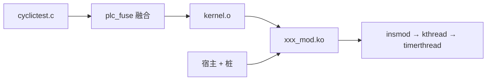

# PLCFusion 完整项目报告

> 路径：`docs/PLCFUSION_完整报告__项目总览.md`  
> 更新：2026-06-16 · 验证：13/13 `.ko` · Pass v3.5 + PLCLowJitterPass

---

## 怎么读这份报告

```
§1 是什么  →  §1.1 关键步骤与产物（文字导读）
                    ↓
              §2 时间线（cyclictest ①→⑩，每步：输入→工具→效果→产物）
                    ↓ 某 Pass 不懂时
              §3 LLVM 机制词典（算法、IR 片段、查表，不重复讲故事）
                    ↓
              §4 运行时  §5 六大类  §6 加强  §7 验证
                    ↓
              附录（kRemap 全表、DCE 全表、13 manifest、命令）
```

| 你想了解… | 读哪里 |
|-----------|--------|
| **关键步骤/产物：做了什么、怎么做** | **§1.1** |
| 整体分几步 | §1 + §2 总览表 |
| cyclictest 完整流水线 | **§2** 按 ①→⑩ |
| mem2reg / remap / float kill / DCE 具体算法 | **§3** |
| timerthread 热循环 IR 长什么样 | **§3.7** |
| `.ko` 链接与 insmod 调用栈 | **§4** |
| 70 条 kRemap 全表 | **附录 G** |

---

## §1 项目是什么

PLCFusion 把用户态 C 编译成 **`${FUSE_NAME}_kernel.o`**（算法机器码），再与 **宿主 `.ko`**（启动 + POSIX 替身）链接。`insmod` 后 **kthread 调用 `main()` / `timerthread()`**——不是把进程搬进内核。



| 概念 | 说明 |
|------|------|
| `_kernel.o` | 你的 **原始 C 算法**（经 IR 变换，无 glibc） |
| 宿主 `.ko` | 只负责 **怎么启动、timer/pthread 怎么假扮** |
| `plc_*` ABI | Pass 把 `malloc`/`timer_create` 等换成内核侧可链接符号 |

---

## §1.1 关键步骤与产物（详细说明）

本节按 **cyclictest 主线**（`manifests/manifest_cyclictest__主线压测.env`）说明：每一步 **做了什么**、**通过什么工具/脚本/代码实现**、**输入输出是什么**、**cyclictest 上的可核对结果**。命令行与 IR 片段见 **§2、§3**；此处不重复贴全表，但保留可验证的事实。

---

### 0. 总流程与职责划分

**入口脚本**：`scripts/plc_fuse__内核化主流程.sh`（生成 `_kernel.o`）→ `scripts/ignite_fused__通用ko构建.sh`（链接 `_mod.ko`）。

**两条并行职责**（必须分开理解）：

| 职责 | 谁负责 | 输入 | 输出 | 说明 |
|------|--------|------|------|------|
| **IR/机器码变换** | Clang + opt + PLCFusion Pass + llc | `cyclictest.c` | `_kernel.o` | 把 POSIX 调用改成 `plc_*`，裁 dead code，生成算法机器码 |
| **运行时替身 + 启动** | 宿主 C + runtime 桩 + Kbuild | `_kernel.o` + 宿主 `.o` | `_mod.ko` | 提供 `module_init`、`plc_timer_create` 等 **可链接实现**，并在 kthread 里调 `main()` |

**未修改**：`test/rt-tests/src/cyclictest/cyclictest.c` 源码。行为差异来自 manifest 变量、Pass 环境变量、以及桩/宿主实现。

---

### ① 准备：manifest 与预检

**做了什么**  
确定本次融合的名字、源文件路径、宿主类型、热路径函数、默认命令行参数，并在编译前扫描源码里是否存在「通常无法内核化」的 API。

**怎么做**

1. **读 manifest**：`plc_fusion_common__公共库.sh` 的 `plc_source_manifest` 加载 `manifest_cyclictest__主线压测.env`。
2. **关键变量（cyclictest 实测值）**：

   | 变量 | 值 | 脚本/Pass 如何使用 |
   |------|-----|-------------------|
   | `FUSE_NAME` | `official_cycletest` | 所有产物前缀 `test/official_cycletest_*` |
   | `FUSE_SOURCE` | `src/cyclictest/cyclictest.c` | 相对 `FUSE_GIT_DIR=rt-tests` 的 Clang 输入 |
   | `FUSE_RUN_MAIN` | `1` | 宿主编译 `-DFUSED_RUN_MAIN=1`，kthread 调 `main()` 而非直接调 `timerthread` |
   | `FUSE_HOST` | `hrtimer` | `ignite_fused` 额外链 `plc_fused_timer_host.o` |
   | `FUSE_WCET_MODE` | `1` | `plc_fusion_pipeline__Pass组合选择.sh` 的 `base_profile` 直接返回 **wcet** |
   | `FUSE_HOT_PATH_FUNCTIONS` | `timerthread,fifothread` | export 为 `PLC_FUSION_HOT_PATH_FUNCTIONS` → wcet-mark + low-jitter |
   | `FUSE_MAIN_ARGS` | `-p 99 -n -i 1000 -m -q` | 宿主 `module_param_string(main_args, ...)` 默认 argv |
   | `FUSE_GLOBALIZE_SYMBOLS` | `shutdown use_nsecs` | Pass export + llc 后 `objcopy --globalize-symbol` |

3. **预检**：`plc_fusion_preflight__源码预检.sh` 对源文件做正则扫描（C++、fork、dlopen、socket 等）。cyclictest **无 critical**；结果可写 `test/official_cycletest.preflight.log`。

4. **TU 自动发现**（本 manifest 单 TU）：`plc_fusion_discover_tu__TU自动发现.sh` 在 `FUSE_EXTRA_SOURCES` 为空时尝试补依赖 `.c`；cyclictest 主线仅 **1 个 TU**。

**产物**：无独立大文件；配置进入后续所有步骤。

---

### ② Clang：C 源码 → 用户态 LLVM IR

**做了什么**  
把 C 编译成 **可读 LLVM IR 文本**（`.ll`），保留函数结构与外部调用，供后续 Pass 改写。

**怎么做**

1. **脚本位置**：`plc_fuse__内核化主流程.sh` 第 `[3/6]` 步。
2. **命令实质**（cyclictest）：

   ```bash
   clang-19 -O2 -fno-builtin -S -emit-llvm \
     -I test/rt-tests/src/include \
     test/rt-tests/src/cyclictest/cyclictest.c \
     -o test/official_cycletest.ll
   ```

   - `-O2`：Clang 前端做内联、尾调用标记、部分循环优化；IR 比 `-O0` 小，但 **外部 call 仍保留**。
   - `-fno-builtin`：**禁止**把 `printf`/`malloc` 等编成 libc 内联序列；否则 IR 里看不到 `@printf`/`@malloc`，Pass 无法 remap。
   - `-S -emit-llvm`：输出 `.ll` 文本，不是 bitcode。

3. **多 TU 时**：每个 `.c` 各生成 `tu_N.ll`，再 `llvm-link -S` 合并为一个 `${FUSE_NAME}.ll`。cyclictest 跳过 link。

**IR 状态（客观描述）**

- `target triple = "aarch64-unknown-linux-gnu"` — 仍是用户态 triple。
- 存在 `declare i32 @pthread_create(...)`、`declare ... @timer_create(...)` 等 — **语义上仍是 glibc/rt-tests 程序**。
- 存在 `%struct.thread_stat` 含 `double` 字段 — 后续 float kill 会处理相关指令，不是 Clang 阶段删除。

**产物**：`test/official_cycletest.ll`（约 299065 B；后续以 `_pre.ll` 为 Pass 输入，`.ll` 可视为中间文件）。

---

### ③ opt 预清理：用户态 IR → `pre.ll`

**做了什么**  
在 **不改动任何外部符号名** 的前提下，用 LLVM 标准 function Pass 整理 IR，便于后续 remap/DCE 遍历。

**怎么做**

1. **脚本位置**：`plc_fuse__内核化主流程.sh` 第 `[4/6]` 步，Pass 串固定为：

   ```bash
   opt -passes="function(mem2reg,instcombine,simplifycfg)" \
     official_cycletest.ll -S -o official_cycletest_pre.ll
   ```

2. **各 Pass 实际效果**（Module 级语义不变）：

   | Pass | 操作 | cyclictest 上可见变化 |
   |------|------|------------------------|
   | **mem2reg** | 可提升的 `alloca` → SSA + PHI | `timerthread` 内栈上 `timespec` 等变为寄存器值 |
   | **instcombine** | 常量折叠、代数化简 | 冗余 `add 0`、部分地址计算合并 |
   | **simplifycfg** | 删 unreachable 块、合并单入单出块 | CFG 边数减少 |

3. **未做**：无 `@timer_create` → `@plc_timer_create`；无函数删除；无 float 处理。

**产物**：`test/official_cycletest_pre.ll` — **6419 行，299131 B**；含 **8** 处 `fadd`/`fdiv`（avg 累加）；**31** 个 unknown extern（`.fusion_report`）。

---

### ④ 分析、探测与 pipeline 选择

**做了什么**  
从 `pre.ll` 和 manifest **推导** DCE 根集合、IR 特征（浮点、unknown extern 数量），选定本次 `opt -passes=...` 的完整字符串，并 export 环境变量给 PLCFusion Pass。

**怎么做**（三个脚本顺序执行）

1. **`plc_fuse_detect__入口探测.sh`**（`[4b]`）  
   - **输入**：manifest + `pre.ll` + 源文件路径。  
   - **方法**：grep IR 中 `define @timerthread` 等模式；结合源码里 `pthread_create(..., timerthread, ...)` 识别线程入口。  
   - **输出**：`test/official_cycletest.detected.env`，例如  
     `FUSE_DETECT_DCE_ROOTS=main,fifothread,timerthread,sighand`  
   - manifest 已设 `FUSE_RUN_MAIN=1` 时，初始 `PLC_FUSION_ROOTS=main`，探测结果 **合并** 进 `FUSE_DCE_ROOTS`。

2. **`plc_fusion_analyze_ir__IR特征分析.sh`**（`[4c]` pre 阶段）  
   - 统计：行数、`has_float`、活跃 `declare` 中不在 kRemap/kKeep 的数量（unknown externs）。  
   - cyclictest：`has_float=1`，`unknown_externs=31`（pre 阶段，含尚未 remap 的 POSIX 名）。

3. **`plc_fusion_pipeline__Pass组合选择.sh`**  
   - **`base_profile`**：`FUSE_WCET_MODE=1` → 直接 **`wcet`**（不落到 generic）。  
   - **`apply_profile(wcet)`** 设定：
     - `PLC_FUSION_KERNEL_PASS=plc-kernelize-wcet`（= mainline 八步 + `PLCFusionWCETMarkPass`）
     - `PLC_FUSION_TAIL_PASSES=function(simplifycfg,sroa,instcombine,loop-mssa(...),globaldce)`
     - `FUSE_LOW_JITTER=1`（wcet profile 默认开启）
   - **`build_opt_passes`** 拼成最终字符串，写入 `test/official_cycletest.pipeline.log`：

     ```
     plc-kernelize-wcet,function(...),globaldce,plc-low-jitter
     ```

4. **export 给 Pass 的环境变量**（`run_kernel_and_llc` 内）：

   | 变量 | cyclictest 值 | Pass 内读取位置 |
   |------|---------------|-----------------|
   | `PLC_FUSION_ROOTS` | `main,fifothread,timerthread,sighand` | `collectRoots()` → DCE BFS 起点 |
   | `PLC_FUSION_HOT_PATH_FUNCTIONS` | `timerthread,fifothread` | `runWCETMark()` + LowJitter Pass |
   | `PLC_FUSION_KEEP_GLOBALS` | `shutdown use_nsecs` | `runExport()` → ExternalLinkage + `llvm.used` |
   | `PLC_FUSION_FLOAT_KILL` | `1`（默认） | `runFloatKill()` |
   | `PLC_FUSION_DCE` | `1` | `runDCE()` |
   | `PLC_FUSION_BLACKHOLE` | `1` | remap 时未映射 call → 返回值改 0/null |
   | `PLC_FUSION_UNMAPPED_LOG` | `test/official_cycletest.unmapped` | 未映射符号追加日志 |

**产物**：`.pipeline.log`、`.detected.env`、`.ir_analysis.log`（若有）；**不修改 IR**。

---

### ⑤ 内核化 Pass + tail + low-jitter：`pre.ll` → `kernel.ll`

**做了什么**  
这是 **语义迁移** 的核心：IR 从「调用 glibc/pthread」变为「调用 `plc_*`」；删除不可达函数与浮点统计路径；标记热路径为 `optnone`；对冷路径再做 LLVM 优化。

**怎么做**

1. **脚本位置**：`run_kernel_and_llc()` 第 `[5/6]` 步。

2. **opt 调用**（cyclictest 实测）：

   ```bash
   opt -load-pass-plugin build/PLCFusionPass.so \
       -load-pass-plugin build/PLCLowJitterPass.so \
       -passes="plc-kernelize-wcet,function(...),globaldce,plc-low-jitter" \
       official_cycletest_pre.ll -S -o official_cycletest_kernel.ll
   ```

3. **段 A — `plc-kernelize-wcet`**（`PLCFusionPass__内核化Pass.cpp` 中 `addKernelizeMainline` + `PLCFusionWCETMarkPass`，**顺序固定**）：

   | 顺序 | Pass 名 | 做什么 | 怎么做（要点） |
   |------|---------|--------|----------------|
   | 1 | **normalize** | 单模块链接属性 | 全部 `GlobalVariable`/`Function` 设 `dso_local` |
   | 2 | **float kill #1** | 删浮点 IR | 扫描指令：`fadd/fdiv/fcmp/uitofp` 等 → 删或改 0；`store double` → `store 0.0`；最多 32 轮 |
   | 3 | **remap** | POSIX → plc_* | 遍历每个 `call`/`invoke`：`kRemap[]` 替换被调函数；`malloc`→`plc_kmalloc`；`pthread_create` 第 3 参数 **promote** 为 ExternalLinkage；`exit`→`plc_exit` |
   | 4 | **dce** | 删不可达函数 | 从 `PLC_FUSION_ROOTS` + 热路径 + 全局 fn 指针 BFS；扫描 `plc_pthread_create`/`plc_signal` 继续 promote；不可达 `define` `eraseFromParent` |
   | 5 | **float kill #2** | 清 DCE 后残留浮点 | 同 #1 |
   | 6 | **export** | 宿主可见全局 | `shutdown`/`use_nsecs` → ExternalLinkage + `@llvm.used` |
   | 7 | **wcet-mark** | 热路径不优化 | 对 `timerthread,fifothread`：`NoInline` + `OptimizeNone` + `"plc-wcet-hot"="true"` |
   | 8 | **cleanup** | 删孤儿 declare | 无引用的 `declare` 移除；blackhole 过的 dead call 清理 |

4. **段 B — `function(...)` tail**  
   - **作用域**：Module 内 **不带 `optnone`** 的函数（主要是 `main`、工具函数）。  
   - **跳过**：`timerthread`、`fifothread`（已被 wcet-mark）。  
   - **Pass**：simplifycfg → sroa → instcombine → loop-rotate/licm → loop-unroll → gvn → adce → instcombine。

5. **段 C — `globaldce`**：删除无引用的全局（如部分 `.str`）。

6. **段 D — `plc-low-jitter`**（`PLCLowJitterPass__低抖动Pass.cpp`）  
   - 读 `PLC_FUSION_HOT_PATH_FUNCTIONS`。  
   - 对列名函数再次：`NoInline` + `OptimizeNone` + `"plc-low-jitter"="true"`。  
   - 控制台：`[PLCLowJitter] 锁定实时任务函数: timerthread`。

**cyclictest 可核对结果**（与 `.fusion_report` 一致）

| 指标 | pre.ll | kernel.ll |
|------|--------|-----------|
| 行数 | 6419 | **5799** |
| `fadd`/`fdiv` | 8 | **0** |
| `define` 个数 | ~50 | **41** |
| `@pthread_create` | 有 | **无**（变为 `@plc_pthread_create`） |
| `timerthread` 属性 | 普通 | **`optnone` + plc-wcet-hot + plc-low-jitter** |
| 活跃 external call | — | **30**（均有桩/宿主/源码实现） |
| 整数 jitter | `sub i64` | **保留**（§3.7） |

**产物**：`test/official_cycletest_kernel.ll`（266674 B）、`test/official_cycletest.unmapped`、`test/official_cycletest.entries`（融合后仍存在的入口符号列表）。

---

### ⑥ llc + objcopy：`kernel.ll` → `kernel.o`

**做了什么**  
把 freestanding IR **Lowering 为 AArch64 ELF  relocatable object**；按需导出全局符号给宿主。

**怎么做**

1. **llc**（`run_kernel_and_llc` 第 `[6/6]` 步）：

   ```bash
   llc-19 -O3 -relocation-model=pic -march=aarch64 -mattr=-fp-armv8,-neon \
     official_cycletest_kernel.ll -o official_cycletest_kernel.o
   ```

   - `-O3`：后端指令选择、寄存器分配、窥孔优化。  
   - `-mattr=-fp-armv8,-neon`：禁用硬件 FP/NEON，与 float kill 一致；否则可能引入 `__muldf3` 等软浮点符号。  
   - **`optnone` 的 `timerthread`**：后端尽量保持基本块顺序，便于 WCET 分析。

2. **objcopy**（manifest 的 `FUSE_GLOBALIZE_SYMBOLS`）：

   ```bash
   objcopy --globalize-symbol=shutdown --globalize-symbol=use_nsecs official_cycletest_kernel.o
   ```

   把原本可能为 `local` 的符号改为全局可见，供 `plc_fused_host.c` 里 `extern int shutdown` 链接。

3. **复制**：`cp official_cycletest_kernel.o official_cycletest_kernel.o_shipped` — Kbuild 与 CI 使用 `_shipped` 作为「已验证融合结果」快照。

**产物**：`official_cycletest_kernel.o` — **84920 B**；`nm` 可见 `T main`、`T timerthread` 等。

---

### ⑦ 桩合并：补齐 `plc_*` 与 kKeep 的 **链接期实现**

**做了什么**  
Pass 只保证 IR 里 **call 的目标符号名** 存在（`declare @plc_xxx` 或已 remap）；`.ko` 链接还需要 **每个被调符号在某一 `.o` 里有函数体**。本步扫描缺口并生成/合并 C 桩。

**怎么做**

1. **`plc_fuse_merge_stubs__桩合并.sh`**（`[6b]`）  
   - 扫描 `kernel.ll`：对每个仍被 `call` 的 `declare @foo`，检查是否在 `src/plc_runtime_stubs__POSIX桩.c`、timer/pthread 宿主、或应用源里已有实现。  
   - 缺失项写入 `test/official_cycletest_runtime_stubs.c`（从公共桩 **复制或生成** 最小实现）。

2. **`plc_fuse_stub_loop__桩闭环.sh`**（最多 3 轮）  
   - 每轮：合并桩 → 可选重跑 fuse → `plc_fuse_report__覆盖率报告.sh` 查「缺少实现」计数。  
   - 直到 **缺少实现 = 0** 或达到轮次上限。

3. **rt-tests 特例（客观事实）**  
   - `warn`、`rt_init` 等函数 **保留在 kernel.o 内**（DCE 未删、源码有 define）。  
   - 公共桩里同名函数标 **`__weak`**，链接时 **强符号（kernel.o）优先**，避免 `multiple definition`。

4. **`plc_fuse_fusion_report__一页报告.sh`**：汇总 pre/kernel 行数、`.o` 大小、活跃 external 30、缺桩 0。

**产物**：`test/official_cycletest_runtime_stubs.c`、`.fusion_report`、`.remap_hints`、`.validate.json`。

---

### ⑧ Kbuild 链接：`kernel.o` + 宿主 + 桩 → `_mod.ko`

**做了什么**  
用内核构建系统把 **算法对象** 与 **模块壳、POSIX 替身** 链成可加载模块。

**怎么做**（`ignite_fused__通用ko构建.sh`）

1. **若需重建**：先调 `plc_fuse__内核化主流程.sh`（或复用 `_kernel.o_shipped`）。

2. **编译宿主与桩**（gcc + 内核头文件），cyclictest 链接集合：

   | 对象文件 | 源 | 提供的符号/行为 |
   |----------|-----|-----------------|
   | `plc_fused_host.o` | `plc_fused_host__通用宿主.c` | `module_init`/`module_exit`；kthread `fused_worker`；`-DFUSED_RUN_MAIN=1` 时调 `main(argc,argv)` |
   | `plc_fused_timer_host.o` | `plc_fused_timer_host__hrtimer宿主.c` | `plc_timer_create/settime/...`（hrtimer ABS + EWMA）；`plc_sigwait` 唤醒路径 |
   | `plc_pthread_host.o` | `plc_pthread_host__pthread宿主.c` | `plc_pthread_create` → 内核 `kthread_create` 跑 `timerthread` 等 |
   | `official_cycletest_runtime_stubs.o` | ⑦ 生成 + 公共桩 | `getopt_long`、`plc_sched_setaffinity` 等 |
   | `official_cycletest_kernel.o` | ⑥ | `main`、`timerthread`、jitter 计算机器码 |

3. **Kbuild**：生成 `official_cycletest_mod.ko`，`modpost` 检查 undefined symbol。

4. **修复环**：`plc_fusion_modpost_fix__ko链接修复.sh` — 若 modpost 报错，向 stubs 追加缺失符号实现并重编（最多 3 次）。

**产物**：`test/official_cycletest_mod.ko` — 可 `insmod` 的内核模块。

---

### ⑨ 运行时：insmod 后的调用链（通用路径）

**做了什么**  
加载模块后，在 **内核线程上下文** 执行与原用户态相同的 **控制流**（main 建线程 → timerthread 循环），但 POSIX 定时/线程 API 由宿主实现。

**怎么做**（按时间顺序）

1. **`insmod official_cycletest_mod.ko`**  
   → `plc_fused_host.c` 的 `module_init` 注册 module 参数、`debugfs`，创建 kthread `plc_fused_worker`。

2. **`fused_worker()`**  
   → 解析 `main_args` module 参数（默认 `-p 99 -n -i 1000 -m -q`）为 `argc/argv`。  
   → **直接 call `main(argc, argv)`** — 符号来自 `official_cycletest_kernel.o`（与 user-space main 同逻辑，已 remap）。

3. **`main()` 内 `plc_pthread_create(..., timerthread, par)`**  
   → 进入 `plc_pthread_host.c`：分配 `thread_param`，`kthread_create` 新任务，入口仍为 **kernel.o 里的 `timerthread`**。

4. **`timerthread()` 循环**（机器码在 kernel.o）  
   → `plc_timer_create` / `plc_timer_settime` → **timer 宿主** 注册 hrtimer，到期向任务发信号。  
   → `plc_sigwait` → 阻塞至 timer 信号。  
   → `plc_ktime_get_ts` + 整数 `sub i64` / `ashr` / `mul` → **jitter 纳秒值**（float avg 已在 Pass 删除，不影响主路径 jitter）。  
   → `hist_sample` 等仍可能 call `plc_*` 或 kKeep 函数（桩/源码提供）。

5. **停止**  
   → `echo 1 > /sys/module/official_cycletest_mod/parameters/shutdown_request`  
   → 宿主写 `shutdown`（globalize 符号）→ main/join 路径退出 → `module_exit`。

**观测**：`/sys/kernel/debug/fused_stats`、`/sys/kernel/debug/fused_timer_stats`（timer 宿主 EWMA 等）。

---

### ⑩ official 压测路径（可选，不换 kernel.o）

**做了什么**  
使用 **同一份** `official_cycletest_kernel.o`，替换为 `plc_runner_official__cyclictest宿主.c` 等更重宿主，做长时 jitter 采集与 wiki 对齐流程。

**怎么做**

- 脚本：`scripts/deploy/ignite_official_cycletest__cyclictest主线.sh`。  
- 增加：ringbuf、`fused_fast.values[]`、decimated export、PNG、CPU 绑核模块参数。  
- **诚实统计**：每次周期调用 `fused_fast_record()`；`jitter_resync_thresh_ns` 默认 **0**（不用阈值丢弃样本做「好看」histogram）。  
- L2 cache 隔离等 tune 由 deploy 脚本集成。

**与 ⑨ 的关系**：**算法 `.o` 相同**；差异仅在宿主与数据采集，用于 8h 等长测。

---

### 关键产物说明（是什么 / 怎么产生 / 何时看）

| 产物 | 是什么 | 怎么产生 | 何时查看 |
|------|--------|----------|----------|
| **`official_cycletest.ll`** | Clang 原始用户态 IR | ② `-emit-llvm` | 怀疑 Clang 标志或 include 问题时 |
| **`official_cycletest_pre.ll`** | 预清理后、**仍未内核化** 的 IR | ③ `mem2reg,instcombine,simplifycfg` | 确认 DCE/remap **之前** 的 CFG、浮点位置 |
| **`official_cycletest_kernel.ll`** | Pass 后的 freestanding IR | ⑤ opt + 双 Pass 插件 | 查 remap 是否完整、`fadd` 是否为 0、热函数是否 `optnone` |
| **`official_cycletest_kernel.o`** | 算法 AArch64 机器码 | ⑥ llc + objcopy | 链接错误时用 `nm -u` 看 undefined |
| **`official_cycletest_kernel.o_shipped`** | 上述 `.o` 的已验证副本 | ⑥ 末尾 `cp` | Kbuild/CI 复用，避免重复 fuse |
| **`official_cycletest.pipeline.log`** | 本次 profile 与完整 opt 命令 | ④ `plc_fusion_pipeline` | 复现 ⑤ 或核对是否 wcet |
| **`official_cycletest.detected.env`** | 自动探测的 DCE roots 等 | ④ `plc_fuse_detect` | 入口被 DCE 误删时 |
| **`official_cycletest.fusion_report`** | 一行表格摘要 | ⑦ 末 `plc_fuse_fusion_report` | **首选**：行数、缺桩、下一步命令 |
| **`official_cycletest.unmapped`** | Pass remap 未映射符号日志 | ⑤ Pass 写 `PLC_FUSION_UNMAPPED_LOG` | 扩展 kRemap 前 |
| **`official_cycletest_runtime_stubs.c`** | 本应用额外桩 C 源 | ⑦ merge + stub_loop | modpost undefined symbol |
| **`official_cycletest_mod.ko`** | 可加载内核模块 | ⑧ Kbuild 链接 | 部署与 insmod |
| **`build/PLCFusionPass.so`** | 内核化 Pass 动态库 | cmake `PLCFusionPass` | Pass 逻辑变更后重建 |
| **`build/PLCLowJitterPass.so`** | 低抖动标记 Pass | cmake `PLCLowJitterPass` | 热路径函数名变更时 |

**建议阅读顺序**：`.fusion_report` → `.pipeline.log` → `_kernel.ll`（grep `plc_timer`、`fadd`、`define @timerthread`）→ 链接失败则 `_runtime_stubs.c` + kbuild log → 运行行为对照 §4 / ⑨ 调用链。

**IR 与 .o 的分工（客观结论）**：`.ll` 供人读与 CI 报告；**链接进 `.ko` 的是 `.o`**。三份 IR 关系：`.ll` → `_pre.ll`（POSIX，已整理）→ `_kernel.ll`（`plc_*`，可 llc）。

---

## §2 主线：cyclictest 端到端（①→⑩）

**清单**：`manifests/manifest_cyclictest__主线压测.env`  
**脚本**：`scripts/plc_fuse__内核化主流程.sh` → `scripts/ignite_fused__通用ko构建.sh`

### 总览

| 步 | 工具 | 输入 → 输出 | cyclictest 指标 |
|----|------|-------------|-----------------|
| ① | git/预检 | `.c` → `test/rt-tests/` | 不改源码 |
| ② | Clang | `.c` → `.ll` | 用户态 IR |
| ③ | opt | `.ll` → `_pre.ll` | **6419** 行 |
| ④ | shell | `pre.ll` → `.pipeline.log` | profile=**wcet** |
| ⑤ | opt+Pass | `pre.ll` → `_kernel.ll` | **5799** 行，0 条 fadd |
| ⑥ | llc | `kernel.ll` → `.o` | **84920** B |
| ⑦ | 桩合并 | → `_runtime_stubs.c` | 缺桩 **0** |
| ⑧ | Kbuild | → `_mod.ko` | 13/13 通过 |
| ⑨ | insmod | 运行 | 见 §4.3 |
| ⑩ | official | 同一 kernel.o | 8h 压测 |

---

### ① 准备

**manifest 摘录**：

| 变量 | 值 | 作用 |
|------|-----|------|
| `FUSE_NAME` | `official_cycletest` | 产物前缀 |
| `FUSE_SOURCE` | `src/cyclictest/cyclictest.c` | 相对 rt-tests |
| `FUSE_RUN_MAIN` | `1` | 宿主 kthread 调 `main()` |
| `FUSE_HOST` | `hrtimer` | 链 `plc_fused_timer_host.o` |
| `FUSE_WCET_MODE` | `1` | pipeline → **wcet** |
| `FUSE_HOT_PATH_FUNCTIONS` | `timerthread,fifothread` | wcet-mark + low-jitter |
| `FUSE_MAIN_ARGS` | `-p 99 -n -i 1000 -m -q` | insmod 默认 argv |
| `FUSE_GLOBALIZE_SYMBOLS` | `shutdown use_nsecs` | objcopy + 宿主协作退出 |

**预检**（`plc_fusion_preflight__源码预检.sh`）：扫描 C++/fork/dlopen/socket；cyclictest **无 critical**。

---

### ② Clang → 用户态 IR

```bash
clang-19 -O2 -fno-builtin -D_GNU_SOURCE -DVERSION="2.8" \
  -S -emit-llvm -I test/rt-tests/src/include \
  test/rt-tests/src/cyclictest/cyclictest.c \
  -o test/official_cycletest.ll
```

**Module 头部（两阶段共有）**：

```llvm
target triple = "aarch64-unknown-linux-gnu"
%struct.thread_stat = type { ..., double, ... }   ; 第 6 字段 avg
%struct.thread_param = type { i32, i32, ... }
@shutdown = ... global i32 0
declare i32 @pthread_create(...)
declare i32 @timer_create(...)
```

**Clang `-O2` 已做**：小函数内联、`tail call` 标记、部分循环优化。  
**仍保留**：所有 **外部 declare + call**（因 `-fno-builtin`）。  
**典型片段**（main 建线程，pre.ll ~1845 行）：

```llvm
%799 = call i32 @pthread_create(ptr %798, ptr %8, ptr @timerthread, ptr %707)
```

**机制详解** → §3.0（Clang 阶段）

---

### ③ opt 预清理 → `pre.ll`

```bash
opt -passes="function(mem2reg,instcombine,simplifycfg)" \
  official_cycletest.ll -S -o official_cycletest_pre.ll
```

| 变化 | 说明 |
|------|------|
| IR 语义 | **仍是用户态**（`@timer_create` 未变） |
| 结构 | alloca 减少、CFG 更短 |
| 行数 | → **6419** |

**机制详解** → §3.1

---

### ④ 分析 + 选 pipeline

| 脚本 | 输出 |
|------|------|
| `plc_fuse_detect__入口探测.sh` | `DCE roots = main,fifothread,timerthread,sighand` |
| `plc_fusion_analyze_ir__IR特征分析.sh` | `has_float=1`, `unknown_externs=31`（pre） |
| `plc_fusion_pipeline__Pass组合选择.sh` | **`profile=wcet`**（`FUSE_WCET_MODE=1`） |

**`test/official_cycletest.pipeline.log` 摘录**：

```
profile=wcet
kernel=plc-kernelize-wcet
tail=function(simplifycfg,sroa,instcombine,loop-mssa(loop-rotate,licm),loop-unroll,gvn,adce,instcombine),globaldce
opt=plc-kernelize-wcet,...,globaldce,plc-low-jitter
low_jitter_funcs=timerthread,fifothread
ir_lines=6419
```

**export 给步骤 ⑤ 的环境变量**：

```
PLC_FUSION_ROOTS=main,fifothread,timerthread,sighand
PLC_FUSION_HOT_PATH_FUNCTIONS=timerthread,fifothread
PLC_FUSION_KEEP_GLOBALS=shutdown use_nsecs
PLC_FUSION_FLOAT_KILL=1
PLC_FUSION_DCE=1
PLC_FUSION_BLACKHOLE=1
```

**profile 决策树** → §3.6

---

### ⑤ opt 内核化 → `kernel.ll`（核心）

```bash
opt -load-pass-plugin build/PLCFusionPass.so \
    -load-pass-plugin build/PLCLowJitterPass.so \
    -passes="plc-kernelize-wcet,function(simplifycfg,sroa,instcombine,loop-mssa(loop-rotate,licm),loop-unroll,gvn,adce,instcombine),globaldce,plc-low-jitter" \
    official_cycletest_pre.ll -S -o official_cycletest_kernel.ll
```

**一条命令里的四段（顺序固定）**：

| 段 | 内容 | 谁被改 |
|----|------|--------|
| **A** | `plc-kernelize-wcet`（八步） | 整个 Module |
| **B** | `function(...)` tail | **仅非 optnone** 函数（main 等冷路径） |
| **C** | `globaldce` | 死全局 |
| **D** | `plc-low-jitter` | 热函数属性 |

**cyclictest 上三步可见结果**：

| 变换 | pre → kernel |
|------|--------------|
| remap | `@pthread_create` → `@plc_pthread_create`；`@timer_*` → `@plc_timer_*` |
| float kill | **8** 处 fadd/fdiv → **0**；整数 jitter `sub i64` **保留** |
| dce | pre **~50** 个 define → kernel **41**；删 ftrace/hist_init 等 |
| wcet-mark | `@timerthread` 加 `optnone` + `plc-wcet-hot` |

**融合报告指标**：活跃 external **30**，缺桩 **0**，`kernel.o` **84920 B**。

**机制详解** → §3.2（八步）、§3.3（tail）、§3.4（low-jitter）、§3.7（热循环 IR）

---

### ⑥ llc → `kernel.o`

```bash
llc-19 -O3 -relocation-model=pic -march=aarch64 -mattr=-fp-armv8,-neon \
  official_cycletest_kernel.ll -o official_cycletest_kernel.o
objcopy --globalize-symbol=shutdown --globalize-symbol=use_nsecs official_cycletest_kernel.o
cp official_cycletest_kernel.o official_cycletest_kernel.o_shipped
```

| 项 | 说明 |
|----|------|
| `optnone` | `timerthread` 汇编接近 IR 块顺序，便于 WCET |
| 无 FP/NEON | 配合 float kill；否则链 `plc_compiler_rt.o` |
| objcopy | 宿主可 `extern int shutdown` 并 `WRITE_ONCE` |

**机制详解** → §3.5

---

### ⑦ 桩合并

1. 扫描 `kernel.ll` 中带 **活跃 call** 的 `declare`。
2. 在 `plc_runtime_stubs__POSIX桩.c` 中找实现；缺失则合并进 `official_cycletest_runtime_stubs.c`。
3. `plc_fuse_stub_loop__桩闭环.sh` 最多 3 轮直到 **缺少实现=0**。

**rt-tests 特例**：`warn`/`rt_init` 等可能在 `_kernel.o` 内已有 **强符号** → 桩侧改 **`__weak`**，链接时强符号优先。

---

### ⑧ Kbuild → `.ko`

**`ignite_fused` 生成的链接关系**：

```
official_cycletest_mod.o
  ├── plc_fused_host.o              # module_init, kthread, main()
  ├── plc_fused_timer_host.o        # plc_timer_* 强符号（ABS hrtimer）
  ├── plc_pthread_host.o            # plc_pthread_create → kthread
  ├── official_cycletest_runtime_stubs.o
  └── official_cycletest_kernel.o   # main, timerthread 算法
```

**modpost 修复环**：链接报 `undefined symbol` → `plc_fusion_modpost_fix__ko链接修复.sh` 追加桩 → 重编（最多 3 次）。

---

### ⑨ 运行时（通用路径）

```
insmod official_cycletest_mod.ko
  │
  ├─ module_init [plc_fused_host.c]
  │     └─ kthread_create(fused_worker, "plc_fused_worker")
  │
  ├─ fused_worker()
  │     └─ main(5, argv)                    ← kernel.o，argv=-p 99 -n -i 1000 -m -q
  │           ├─ plc_pthread_create(..., timerthread, par)  ← kernel.o 调 plc_* 
  │           │     └─ [pthread 宿主] 新 kthread → timerthread(par)  ← kernel.o
  │           └─ plc_pthread_join ...
  │
  └─ timerthread() 内：
        plc_timer_create / plc_timer_settime   ← timer 宿主 hrtimer
        plc_sigwait                              ← 等 timer 信号
        sub i64 … 算 jitter                      ← kernel.o 整数路径（未 float kill）
```

**debugfs**：`/sys/kernel/debug/fused_stats`、`/sys/kernel/debug/fused_timer_stats`  
**停止**：`echo 1 > /sys/module/official_cycletest_mod/parameters/shutdown_request`

**详解** → §4

---

### ⑩ official 压测（可选）

同一 `official_cycletest_kernel.o`，宿主换 `plc_runner_official__cyclictest宿主.c`：

| 能力 | 说明 |
|------|------|
| ringbuf / decimated export | `fused_fast.values[]`、PNG |
| CPU 绑定 | `jitter_probe_cpu`、`timerthread_cpu` |
| 诚实 jitter | **始终** `fused_fast_record()`；`jitter_resync_thresh_ns` 默认 **0** |
| L2 隔离 | `ignite_official_cycletest` 集成 tune 脚本 |

---

## §3 LLVM 机制词典

> 本节是 **技术参考**。§2 只标「发生了什么」；此处说明 **怎么发生的**。

### 3.0 Clang 阶段（步骤 ②）

| Flag | 若去掉会怎样 |
|------|--------------|
| `-O2` | IR 更大、alloca 更多，后续 Pass 更慢 |
| `-fno-builtin` | `printf` 可能被编成 `write` 内联，**Pass 无法 remap 成 plc_printk** |
| `-emit-llvm -S` | 人类可读的 `.ll`，便于 `plc_fuse_report` 扫描 |

cyclictest 单 TU 编译，**无 llvm-link**（多 TU manifest 会先 per-TU clang 再 `llvm-link`）。

---

### 3.1 预清理 Pass（步骤 ③）

#### mem2reg

- **输入**：`timerthread` 入口十几条 `%x = alloca %struct.timespec` 等。
- **算法**：Promote Memory To Register — 对只被 load/store 的 alloca 建 SSA，插入 PHI。
- **结果**：def-use 链清晰，DCE/remap 遍历更简单。

#### instcombine

- 折叠：`add i64 0, %x` → `%x`；`mul`+周期常数合并。
- **不跨函数**、不删有副作用的 `call`。

#### simplifycfg

- 删 `unreachable` 后死块；合并单前驱单后继块。

---

### 3.2 PLCFusion 八步（步骤 ⑤-A）

源码：`backend/pass/PLCFusionPass__内核化Pass.cpp` v3.5  
注册名：`plc-kernelize-wcet` = mainline + `PLCFusionWCETMarkPass`

#### 步骤 1 — normalize

```cpp
G.setDSOLocal(true);  // 所有 GlobalVariable
F.setDSOLocal(true);  // 所有 Function
```

单 `.o` 链接模型；减少错误的外部 interposable。

#### 步骤 2 — float kill（第 1 轮）

**条件**：`PLC_FUSION_FLOAT_KILL=1` 且 Module 含浮点类型/指令。

**算法**：最多 32 轮扫描全部 Instruction，`killOneFloatInst`：

| IR | 处理 |
|----|------|
| `fadd/fsub/fmul/fdiv` | 删指令，uses→0.0 |
| `fcmp` | uses→false |
| `uitofp/sitofp/fptosi` | 删或→0 |
| `store double` | 改为 `store double 0.0` |
| `call @__muldf3` 等 | 删 call 或返回 0 |

**cyclictest 实测**：

```llvm
;; pre.ll ~3466 — avg 累加（会被 kill）
%369 = uitofp i64 %357 to double
%371 = fadd double %370, %369
store double %371, ptr %248

;; kernel.ll — 上述消失；grep fadd/fdiv = 0
```

**保留**：`sub i64` jitter 路径（§3.7）。

#### 步骤 3 — remap

**流程**（每个 `call`/`invoke`）：

```
resolve 被调符号
  ├─ 已定义函数（非 declare）→ 跳过
  ├─ kKeep[] → 保留 declare
  ├─ kRemap[] → setCalledFunction(plc_*)
  └─ 否则 + BLACKHOLE=1 → 返回值改 0/null，删 call
```

**特殊规则**：

| 符号 | 行为 |
|------|------|
| `malloc(n)` | `plc_kmalloc(zext n)` |
| `pthread_create(..., fn, ...)` | `promoteThreadEntry`：fn 的 `Function` → ExternalLinkage |
| `exit/abort/_exit` | → `plc_exit`；`invoke` 变 branch |

**cyclictest timerthread 内 remap 链**：

```
timer_create/settime/getoverrun/delete → plc_timer_*
clock_gettime / clock_nanosleep        → plc_ktime_get_ts / plc_clock_nanosleep
pthread_self / setaffinity_np          → plc_pthread_self / plc_pthread_setaffinity_np
pthread_mutex_*                        → plc_mutex_*
sigwait                                → plc_sigwait
```

**全表** → 附录 G。

#### 步骤 4 — dce

**算法**（BFS）：

1. `collectRoots`：`PLC_FUSION_ROOTS` + 热路径名 + **全局函数指针**（v3.5）。
2. 扫描全 Module call：`plc_pthread_create` → promote 第 3 参数；`plc_signal` → promote handler。
3. BFS 标记可达；不可达 `define` → `eraseFromParent()`。

**cyclictest 删除函数** → 附录 C（完整 15 个）。  
**保留入口**：`main`, `timerthread`, `fifothread`, `sighand`。

#### 步骤 5 — float kill（第 2 轮）

DCE 删函数后清残留浮点。

#### 步骤 6 — export

`shutdown`、`use_nsecs` → ExternalLinkage + `llvm.used` → 供 objcopy/宿主。

#### 步骤 7 — wcet-mark

```cpp
F->addFnAttr(NoInline);
F->addFnAttr(OptimizeNone);
F->addFnAttr("plc-wcet-hot", "true");
```

**kernel.ll attributes #9**：

```llvm
attributes #9 = { noinline nounwind optnone uwtable
                  "plc-wcet-hot"="true" "plc-low-jitter"="true" ... }
define dso_local noalias ptr @timerthread(...) #9
```

#### 步骤 8 — cleanup

- 删无引用的 `declare`（孤儿 declare 约 **53** 个）。
- remap 阶段已 blackhole 的 call 不再留死代码。

---

### 3.3 Tail Pass（步骤 ⑤-B）

**跳过** 带 `optnone` 的函数（`timerthread`、`fifothread`）。

| Pass | 作用 |
|------|------|
| simplifycfg | main 里 getopt 分支压平 |
| sroa | `%struct.thread_param` 字段拆成标量访问 |
| instcombine | argv/掩码解析常量折叠 |
| loop-rotate | 循环结构利于 licm |
| licm | `@shutdown` 等不变 load 外提 |
| loop-unroll | 小循环展开 |
| gvn | 重复 load 合并 |
| adce | 删 tail 产生的死代码 |
| instcombine | 收尾 |
| globaldce | 删未引用 `@.str.*` 等 |

---

### 3.4 plc-low-jitter（步骤 ⑤-D）

**文件**：`PLCLowJitterPass__低抖动Pass.cpp`  
**读 env**：`PLC_FUSION_HOT_PATH_FUNCTIONS` / `PLC_FUSION_WCET_HOT_FUNCTIONS`  
**效果**：再次 `NoInline` + `OptimizeNone` + `"plc-low-jitter"="true"`  
**控制台**：`[PLCLowJitter] 锁定实时任务函数: timerthread`

---

### 3.5 llc 后端（步骤 ⑥）

| 阶段 | 说明 |
|------|------|
| Legalize | IR → target 合法指令 |
| ISel | DAG → AArch64 指令 |
| RegAlloc | 线性 scan / greedy |
| Peephole | 局部优化 |
| Emit | ELF `.o`，PIC relocation |

`-mattr=-fp-armv8,-neon`：禁止硬件浮点/NEON，与 float kill 一致。

---

### 3.6 pipeline profile 决策

```
FUSE_WCET_MODE=1 ? → wcet
FUSE_NAME=plc_cc_* 或 FUSE_KTHREAD_ENTRY=plc_* ? → auto LowJitter=1
IR 超大 ? → size
unknown 过多（pre 阈值）? → debug（wcet 模式跳过 auto-refine 降级）
```

| Profile | 内核链 | tail | wcet-mark |
|---------|--------|------|-----------|
| **wcet** | mainline+wcet-mark | 完整 | ✅ |
| hotpath | mainline+wcet-mark | 无 | ✅ |
| generic | mainline | globalopt | ❌ |
| debug | remap+export | 无 | ❌，DCE 关 |

---

### 3.7 timerthread 热循环 IR（kernel.ll 摘要）

**属性**：`optnone` — tail Pass **不改**此函数。

**主循环入口**（~256 行起）：按 `thread_param.mode` **switch**：

| mode | IR 行为 | 运行时 |
|------|---------|--------|
| 0, 2 | `call @plc_sigwait` | timer 宿主唤醒 |
| 1 | `call @plc_clock_nanosleep` | nanosleep 路径 |
| 3 | `plc_ktime_get_ts` + `plc_clock_nanosleep` | 手工对齐 |

**jitter 计算**（整数，~3474 行，**float kill 后仍保留**）：

```llvm
%401 = load i64, ptr %7           ; now
%403 = sub i64 %401, %215         ; delta
%405 = ashr exact i64 %404, 32
%406 = mul nsw i64 %405, 1000000
%411 = add nsw i64 %406, %410
%412 = icmp sgt i64 %411, -1      ; vs tracelimit → spikes
```

**对比 pre.ll**：同段逻辑含 `fadd double` 更新 avg；kernel 中 avg 路径已 kill。

---

## §4 运行时与宿主

### 4.1 符号解析优先级（链接 `.ko` 时）

| 符号类 | 提供者 | 例 |
|--------|--------|-----|
| 算法 | `_kernel.o` | `timerthread`, `main` |
| 强符号 POSIX 替身 | timer/pthread 宿主 | `plc_timer_create` |
| weak 桩 | runtime_stubs | `getopt_long`, `warn`（若 kernel.o 无强定义） |
| 内核导出 | vmlinux | `printk`, `kmalloc`（经 plc_* 包装） |

### 4.2 hrtimer 宿主模块参数

| 参数 | 默认 | 含义 |
|------|------|------|
| `fused_hrtimer_abs` | 1 | ABS pinned 定时 |
| `fused_hrtimer_cpu` | -1 | 绑 CPU |
| `fused_hrtimer_jitter_comp` | true | EWMA 补偿 |

### 4.3 通用 vs official

| | 通用 | official |
|--|------|----------|
| kernel.o | 相同 | 相同 |
| ringbuf/PNG | ❌ | ✅ |
| 8h + 诚实统计 | 可用 | **推荐** |
| CPU 隔离 | 手动 profile | 脚本集成 |

---

## §5 六大类与 manifest 全表（13 个可构建 + 1 模板）

CI `run_ko_build__全类ko编译.sh` 覆盖 **13** 个应用 manifest；`manifest_template__清单模板.env` 仅作复制模板。

| 大类 | FUSE_NAME | manifest | 典型 FUSE_HOST / 备注 |
|------|-----------|----------|------------------------|
| 1 多线程 | signaltest | `manifest_signaltest__信号测试.env` | pthread；信号 + 互斥 |
| 1 | ptsematest | `manifest_ptsematest__互斥锁测试.env` | pthread；POSIX 信号量 |
| 2 周期压测 | official_cycletest | `manifest_cyclictest__主线压测.env` | **hrtimer**；`FUSE_WCET_MODE=1` |
| 2 | official_cycletest_multitu | `manifest_cyclictest__多TU压测.env` | hrtimer + `histogram.c` 自动发现 |
| 3 demo | github_rt_periodic | `manifest_github_rt_periodic__周期demo.env` | hrtimer；单 TU |
| 3 | github_rt_periodic_multitu | `manifest_github_rt_periodic_multitu__多TU.env` | 多 TU llvm-link |
| 4 plc-cc | plc_cc_hello | `manifest_plc_cc_hello__入门.env` | 无 timer；auto LowJitter |
| 4 | plc_cc_gpio | `manifest_plc_cc_gpio__PLC示例.env` | GPIO 周期任务 |
| 4 | plc_cc_temp_control | `manifest_plc_cc_temp_control__温控.env` | 温控逻辑 |
| 4 | plc_cc_isolation | `manifest_plc_cc_isolation__隔离测试.env` | CPU 隔离相关 |
| 4 | plc_cc_pure_logic | `manifest_plc_cc_pure_logic__纯逻辑.env` | 无 I/O 桩依赖 |
| 4 | plc_cc_dither | `manifest_plc_cc_dither__抖动测试.env` | 抖动测量 demo |
| 5 单 TU | github_stb_sprintf | `manifest_github_stb_sprintf__sprintf_demo.env` | stb sprintf；size/debug profile |

---

## §6 本次加强（代码级）

| 加强 | 文件 | 效果 |
|------|------|------|
| Pass v3.5 | `PLCFusionPass__内核化Pass.cpp` | GEP/常量表间接 call；全局 fn 指针进 DCE |
| LowJitter 入 fuse | `plc_fuse__内核化主流程.sh` | 双 `-load-pass-plugin` |
| hrtimer 增强 | `plc_fused_timer_host__hrtimer宿主.c` | ABS/EWMA/debugfs |
| CPU 亲和 | pthread 宿主 + runtime 桩 | 真 `set_cpus_allowed_ptr` |
| 桩 `__weak` | `plc_runtime_stubs__POSIX桩.c` | 无 duplicate symbol |
| TU 发现 | `plc_fusion_discover_tu__TU自动发现.sh` | cyclictest→histogram.c |
| 功能 CI | `run_functional_ci__功能门禁.sh` | ko + kbuild 门禁 |

---

## §7 验证与排错

```bash
bash scripts/plc_fuse__内核化主流程.sh manifests/manifest_cyclictest__主线压测.env
bash scripts/plc_fuse_report__覆盖率报告.sh manifests/manifest_cyclictest__主线压测.env
bash scripts/run_ci__CI门禁.sh
bash scripts/run_ko_build__全类ko编译.sh
```

| 现象 | 原因 | 处理 |
|------|------|------|
| `multiple definition of warn` | kernel.o 与桩同强符号 | 桩 `__weak`；删旧 stubs 重生 |
| `init_module` 重复 | 子 .c 误写 module_init | 仅 `plc_fused_host.c` 可有 |
| pipeline 非 wcet | 未设 `FUSE_WCET_MODE` | 改 manifest |
| float 链接失败 | IR 残留 `__muldf3` | `FUSE_LINK_COMPILER_RT=auto` |

---

## 附录 A：`PLC_FUSION_*` 环境变量

| 变量 | cyclictest 值 | 作用 |
|------|---------------|------|
| `PLC_FUSION_ROOTS` | main,fifothread,timerthread,sighand | DCE 根 |
| `PLC_FUSION_HOT_PATH_FUNCTIONS` | timerthread,fifothread | wcet-mark + LJ |
| `PLC_FUSION_KEEP_GLOBALS` | shutdown use_nsecs | export |
| `PLC_FUSION_FLOAT_KILL` | 1 | 删浮点 IR |
| `PLC_FUSION_DCE` | 1 | 可达性裁剪 |
| `PLC_FUSION_BLACKHOLE` | 1 | 未映射→0/null |
| `PLC_FUSION_UNMAPPED_LOG` | `.unmapped` | 缺映射日志 |

---

## 附录 B：manifest 变量

| 变量 | 含义 |
|------|------|
| `FUSE_PIPELINE` | auto / wcet / debug … |
| `FUSE_LOW_JITTER` | auto：wcet/plc_cc 时开 |
| `FUSE_AUTO_DISCOVER_TU` | 自动 `FUSE_EXTRA_SOURCES` |
| `FUSE_LINK_PTHREAD_HOST` | 链 pthread 宿主 |
| `FUSE_MAX_UNMAPPED` | 覆盖率门禁阈值 |

---

## 附录 C：DCE 删除函数（cyclictest 完整）

pre 有、kernel 无：

1. `get_tracers`  
2. `valid_tracer`  
3. `setevent`  
4. `event_enable_all` / `event_disable_all` / `event_enable` / `event_disable`  
5. `policy_to_string` / `string_to_policy`  
6. `parse_mem_string`  
7. `err_quit` / `debug`  
8. `hist_init` / `hist_init_oflow` / `hist_destroy`  

**仍保留 define**（**41** 个）：含 `main`, `timerthread`, `fifothread`, `sighand`, `print_stat`, `hist_sample`, `warn`, `rt_init`, …

---

## 附录 D：三份 IR 对照

| | `.ll` | `_pre.ll` | `_kernel.ll` |
|--|-------|-----------|--------------|
| 语义 | 用户态 | 用户态（整理后） | freestanding |
| pthread | `@pthread_create` | 同 | `@plc_pthread_create` |
| float | 8× fadd/fdiv | 同 | **0** |
| timerthread | `internal` | 同 | `dso_local` + **optnone** |
| 行数 | — | 6419 | 5799 |
| 字节 | — | 299131 | 266674 |

---

## 附录 E：产物文件树（cyclictest）

```
test/
  official_cycletest.ll              # Clang（中间，可不保留）
  official_cycletest_pre.ll          # ③
  official_cycletest_kernel.ll       # ⑤
  official_cycletest_kernel.o        # ⑥
  official_cycletest_kernel.o_shipped
  official_cycletest.pipeline.log    # ④
  official_cycletest.detected.env
  official_cycletest.fusion_report
  official_cycletest.unmapped
  official_cycletest_runtime_stubs.c # ⑦
  official_cycletest_mod.ko            # ⑧
build/
  PLCFusionPass.so
  PLCLowJitterPass.so
```

---

## 附录 F：自验证命令

```bash
wc -l test/official_cycletest{,_pre,_kernel}.ll
grep -cE ' fadd | fdiv ' test/official_cycletest_pre.ll
grep -cE ' fadd | fdiv ' test/official_cycletest_kernel.ll   # 期望 0
grep 'define.*@timerthread' test/official_cycletest_kernel.ll -A0
grep plc_timer_create test/official_cycletest_kernel.ll | head -3
nm test/official_cycletest_kernel.o | grep -E ' timerthread| main'
```

---

## 附录 G：kRemap 全表（v3.5）

| From | To |
|------|-----|
| printf | plc_printk |
| puts | plc_puts |
| fprintf | plc_fprintf |
| dprintf | plc_dprintf |
| warn | plc_warn |
| info | plc_info |
| fatal | plc_fatal |
| err_msg | plc_warn |
| err_msg_n | plc_err_msg_n |
| perror | plc_perror |
| clock_gettime | plc_ktime_get_ts |
| clock_getres | plc_ktime_get_ts |
| nanosleep | plc_nanosleep |
| clock_nanosleep | plc_clock_nanosleep |
| malloc | plc_kmalloc |
| calloc | plc_kcalloc |
| realloc | plc_krealloc |
| strdup | plc_kstrdup |
| free | plc_kfree |
| timer_create | plc_timer_create |
| timer_settime | plc_timer_settime |
| timer_getoverrun | plc_timer_getoverrun |
| timer_delete | plc_timer_delete |
| sigemptyset | plc_sigemptyset |
| sigaddset | plc_sigaddset |
| sigprocmask | plc_sigprocmask |
| sigwait | plc_sigwait |
| signal | plc_signal |
| sigaction | plc_sigaction |
| __assert_fail | plc_assert_fail |
| pthread_self | plc_pthread_self |
| pthread_setaffinity_np | plc_pthread_setaffinity_np |
| pthread_create | plc_pthread_create |
| pthread_join | plc_pthread_join |
| pthread_kill | plc_pthread_kill |
| pthread_mutex_init | plc_mutex_init |
| pthread_mutex_destroy | plc_mutex_destroy |
| pthread_sigmask | plc_sigprocmask |
| gettid | plc_gettid |
| sched_setscheduler | plc_setscheduler |
| sched_setaffinity | plc_sched_setaffinity |
| gettimeofday | plc_gettimeofday |
| pthread_mutex_lock | plc_mutex_lock |
| pthread_mutex_unlock | plc_mutex_unlock |
| pthread_cond_wait | plc_cond_wait |
| pthread_cond_signal | plc_cond_signal |
| pthread_cond_broadcast | plc_cond_broadcast |
| pthread_cond_timedwait | plc_cond_timedwait |
| pthread_barrier_init | plc_barrier_init |
| pthread_barrier_wait | plc_barrier_wait |
| mlockall | plc_mlockall |
| munlockall | plc_munlockall |
| mlock | plc_mlock |
| getpid | plc_getpid |
| open | plc_open |
| read | plc_read |
| write | plc_write |
| close | plc_close |
| mmap | plc_mmap |
| munmap | plc_munmap |
| shm_open | plc_shm_open |
| shm_unlink | plc_shm_unlink |
| lseek | plc_lseek |
| ftruncate | plc_ftruncate |
| stat | plc_stat |
| unlink | plc_unlink |
| mkfifo | plc_mkfifo |
| fopen | plc_fopen |
| fclose | plc_fclose |
| fdopen | plc_fdopen |
| exit / abort / _exit | plc_exit |

**kKeep（不 remap，靠桩或源码）**：`memset`, `memcpy`, `strlen`, `snprintf`, `hist_*`, `hset_*`, `rt_init`, `numa_*`, `getopt_long`, `stbsp_*`, `plc_cycle`, … — 见 Pass 内 `kKeep[]`。

---

## 附录 H：调试单独 Pass

```bash
export PLC_FUSION_DCE=0 PLC_FUSION_BLACKHOLE=0
opt -load-pass-plugin build/PLCFusionPass.so \
  -passes=plc-fusion-remap \
  test/official_cycletest_pre.ll -S -o /tmp/remap_only.ll
```

| 注册名 | 用途 |
|--------|------|
| plc-fusion-remap | 仅 POSIX 映射 |
| plc-fusion-dce | 仅裁剪 |
| plc-fusion-float | 仅 float kill |
| plc-kernelize-debug | 不 DCE、不 blackhole |

---

*结构：§2 时间线（发生了什么）→ §3 词典（为什么/怎么做）→ §4–7 运行与验证 → 附录（全表/命令）。*
